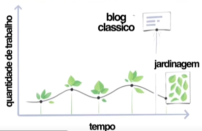
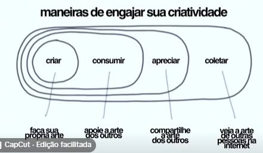

Lendo o livro [[Criando um Segundo Cérebro]] eu me deparei a primeira vez com a ideia do que seria um **Jardim Digital**
Logo após algumas coisas relacionadas a isso começaram a aparecer pra mim no TikTok como o vídeo [[O que é um Jardim Digital#Use a internet a seu favor (@maiastrz)]] e outros conteúdos que vou falar logo aqui abaixo

## Conteúdos:
### Use a internet a seu favor (@maiastrz)
Link: https://vt.tiktok.com/ZSC3RuWkS/
- "Não adianta nada trocar seu tempo de tela pra ler por 8 horas, ou pra ficar vendo filme. No final do dia você ainda está **consumindo**. E o problema é que as pessoas **só estão consumindo**"
	- O que você tá retendo? O que está te fazendo pensar?
- As redes sociais podem agregar na sua vida se você **souber como fazer isso** -> pra isso que surge o <mark>Jardim Digital</mark>
	- É tipo um caderno ou blog só que no seu jardim as suas anotações vão **"crescendo"**
	- 
- Normalmente quando estamos no tiktok e **vemos algo legal a gente salva mas nunca volta nesse conteúdo**
	- A ideia agora é que você **pegue o link desse vídeo, jogue no seu jardim e escreva um pouco sobre ele** (exatamente como eu estou fazendo agora!)
		- Pode ser qualquer coisa, desde um resuminho até uma ideia de artigo ou post
	- Ele não é pra você fazer pra ninguém, é algo pra você (apesar de que eu estou tornando público pra ver se isso pode motivar outras pessoas)
- O objetivo é entender que **as notas não estão finalizadas**, elas são algo que pode ir **crescendo** (semente > broto > árvore)
- Encontrar maneiras de **engajar a sua criatividade**
	- 
- Você adiciona **tags** e vai percebendo como as coisas se **conectam**
	- E quando você vai consumindo e criando suas notas pode surgir uma criação sua, um conteúdo seu
- <mark>Só de escrever lá você está fazendo algo além de consumir, você está cultivando suas ideias</mark>
- Muda a forma como a gente consome conteúdo
- Sugestão de conteúdo: [criando um jardim digital para fugir do brainrot .𖥔 ݁ ˖](https://youtu.be/O9Prnl_IuMs?si=IJwyS8aCCMtt6T9J)

### criando um jardim digital para fugir do brainrot .𖥔 ݁ ˖
Link: https://youtu.be/O9Prnl_IuMs?si=IJwyS8aCCMtt6T9J

### Criando um jardim digital para acabar com o meu scroll infinito (Anna Howard)
Link: https://youtu.be/0tY7Z53QJo8?si=OKhhLmovhrpaJFHI
- é um lugar para você fazer **conexões** de tudo que você está consumindo
	- diferente de um blog, você não escreve em ordem cronológica
	- você vai colocando tudo ali e conectando, criando links e relações e vai ver como todas as coisas vão se conectando
- **para ser mais interessante, você precisa ser mais interessado**
	- Procure algo que te interessa e vá fundo nisso, entre de cabeça mesmo. Isso vai fazer você ser muito mais interessante
- Cada vez mais vemos pessoas falando sobre deixar as redes sociais, sobre como é fatigante ficar no celular e como ficar scrollando infinitamente faz mal a elas
- Dica de vídeo [[Obsidian#Tutorial de Obsidian (Odysseas)]]