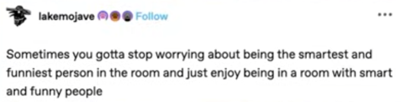
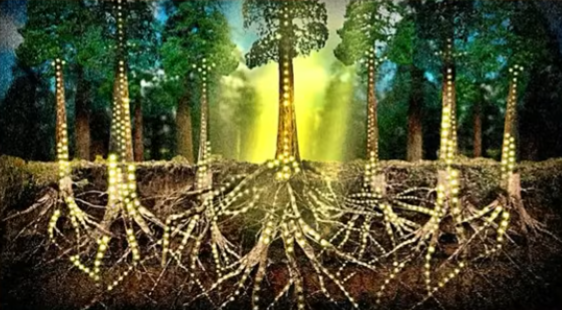
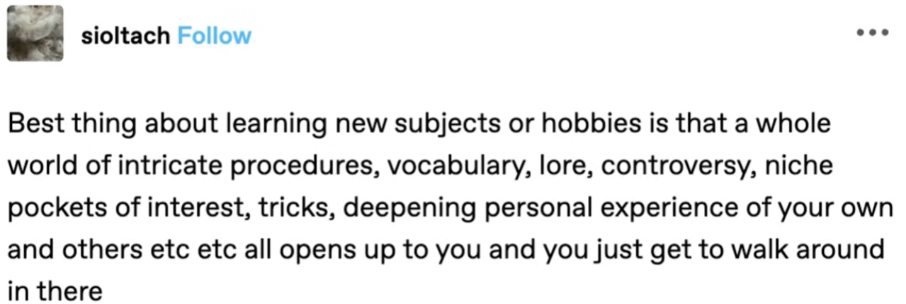
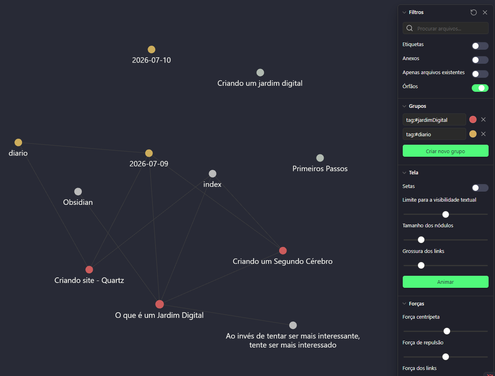

# Resumo
<mark>O que é um Jardim Digital?</mark>
Será o lugar pra você **cultivar suas ideias ao longo do tempo e conectar os assuntos**
Ele serve para nos **tornar mais conscientes do que estamos consumindo** através do **plantio de sementes** (conteúdos que consumimos) que serão cuidadas e desenvolvidas em pequenos **brotos** (nota com alguns insights, resumos e ideias que tivemos) até finalmente virar uma **árvore** (um conteúdo mais trabalhado que pode virar a nossa arte)

# Conteúdo
Lendo o livro [[Criando um Segundo Cérebro]] eu me deparei a primeira vez com a ideia do que seria um **Jardim Digital**
Logo após algumas coisas relacionadas a isso começaram a aparecer pra mim no TikTok como o vídeo [[O que é um Jardim Digital#Use a internet a seu favor (@maiastrz)]] e outros conteúdos que vou falar logo aqui abaixo
Nesse tempo veio a pergunta: **"Você tem algum hobby que não seja consumir?"**. E aqui eu não estou falando de apenas comprar, mas de **ficar horas rolando o feed do tiktok e no final do dia sequer conseguir listar 3 ou 4 conteúdos que você riu, ou que achou interessante ou que você sequer se lembre**
O que era pra ser um momento pra gente se distrair e desligar um pouco, acaba virando mais ansiedade, fomo e até uma raiva devido a quantidade de conteúdos que fazem mal pra gente. Antigamente a gente assistia um filme e se distraia, hoje a gente consome conteúdo talvez por 2, 3 horas e sente que não descansou (muitas vezes, nos sentimos até mais cansado).
**A ideai do jardim digital é exatamente tornar a gente mais consciente do que estamos consumindo** e dali **tirar alguns brotos** (ideias) **que depois podem crescer e virar árvores** (projetos seus, como um artigo no LinkedIn, um vídeo no YouTube ou até mesmo uma nova ideia revolucionário que vai fazer você ficar milionário)
- E isso **não é sobre fazer tudo virar um trabalho, mas sobre ter mais qualidade nos seus momentos de lazer**. É pra tentar buscar um consumo mais proveitoso e até mesmo mais divertido (e também treinar seu algoritmo para coisas que te façam bem, afinal o que mais tem nas redes sociais é ragebait)
	- Inclusive se você quer saber mais sobre ragebait recomendo fortemente esse vídeo: [RAGE BAIT: expondo Virgínia, Malu Borges e a cultura do ódio (O Jean Luca)](https://www.youtube.com/watch?v=a8wgvfvP0NM&t=934s)

Então, vamos responder...
## O que é um Jardim Digital?
- É um espaço pessoal onde **o objetivo e ir <mark>cultivando ideias</mark> ao longo do tempo**
	- "É um **lugar para você plantar as suas ideias**, registrar coisas que aprecia, desenvolver as ideias de uma forma **contínua, orgânica e não linear**. É uma coleção de **ideias livres e em evolução**"
- Diferente de um blog que acontece em ordem cronológica, no jardim o ponto principal é **a conexão entre as publicações** (inclusive podemos ver o link entre elas)
- Ao invés de publicar textos finalizados e bonitinhos, a intenção é exatamente ser **algo constantemente em construção**. Você **planta ideias** (sementes) e **vai cuidando delas** ao longo do tempo até elas virarem algo (árvores)
- O seu jardim digital <mark>nunca está pronto!</mark> E é essa a parte fantástica!
	- Você pode estar sempre voltando em uma nota e melhorando, recriando algo, aprendendo uma coisa nova, apagando o que não faz mais sentido
	- A ideia é que **as anotações vão crescendo de semente (🌱) pra broto (🌿) e finalmente pra árvore (🌲)**
- Diferente de outros lugares que você escreve pra audiência, **aqui você vai escrever primeiramente pra você mesmo, aprendendo em público e quem quiser vai passear por ali** (e pode contribuir também)
- **Onde vai estar o seu jardim depende muito de qual ferramenta você se sente mais confortável**, eu uso o **Obsidian** (+ GitHub e Quartz pra deixar online), mas existem outras opções como Notion, Capacities, entre outras
	- A ideia é que **seja digital** (e não em um caderno) para permitir alterações, ajustes e melhorias de forma prática e rápida
- Acredite, com o tempo o Jardim Digital vai mudar completamente a forma como você consome e se relaciona com os conteúdos

E agora surge a pergunta...
## Como fazer meu jardim digital?
- Não vou falar de ferramentas aqui, mas em breve vou criar conteúdo explicando como eu uso o Obsidian pra isso.
- **Quando você tiver consumindo algo** e achar interessante (quando **aquilo te tocar** de alguma forma) **pega o link disso e joga aqui no seu jardim** (cria uma nova nota e coloca a URL lá)
- Tira um tempinho pra **ver aquilo com atenção** e **tenta fazer uma lista de insights interessantes, um resumo ou qualquer anotação sobre o que você achou dele**
	- Nesse momento sua anotação vai ser uma pequena **semente (🌱)**
	- Isso te obriga a refletir sobre aquilo que você consumiu e a reter melhor essa informação
- Quando sentir vontade, **volte nessa anotação**, incremente coisas, traga novos links e descobertas e **vá fazendo aquilo evoluir** de forma a desenvolver essa ideia
	- Agora você já tem um pequeno **brotinho (🌿)**
- Em algum momento **essa ideia já vai estar mais bem estruturada**, você já vai ter bastante coisa legal e pq não pensar em **criar algo a partir disso**? Pode ser um post, um tweet, um artigo, **qualquer coisa que você consiga mostrar o seu conhecimento**
	- Você finalmente tem uma **árvore (🌲)**
	- **Ideias são apenas pensamentos até que você as coloque em prática**. E pensamentos desaparecem com o tempo. -> para concretizar uma ideia é preciso fazer e **nós aprendemos fazendo!**
	- **A informação só se torna conhecimento** – pessoal, incorporado, verificado – **quando é utilizada**. Você só ganha confiança naquilo que sabe quando tem certeza de que funciona. Antes disso, tudo não passa de teoria.
- Agora que você já tem sua nota, outra coisa fundamental em um jardim digital são as **tags**, que **vão servir para linkar os assuntos e criar uma rede de conhecimento**
	- mas não comece seu jardim tentando encontrar um esquema de tags perfeito, pois você não vai.
		- Etiquete as notas retroativamente e **apenas quando necessário**
	- Pense no que faz mais sentido nessa nota e coloque tags de acordo com isso, no momento que escrevo eu tenho basicamente 3 tags por enquanto: jardimDigital (todos os conteúdos relacionados a o que é e como criar jardins digitais), livros (todos os conteúdos que vieram de livros que eu li) e ferramentes (conteúdos sobre ferramentas que eu uso como Obsidian e GitHub)
	- Não precisa fazer sentido pros outros, desde que faça sentido pra você e seja possível relacionar os seus assuntos
- **Crie também links entre os seus conteúdos**, por exemplo um livro que eu crie uma anotação dele e que tem muita relação com esse assunto é o [[Criando um Segundo Cérebro]]
- Agora pense nisso que você tá fazendo como algo em constante evolução e vá adicionando as melhorias que achar melhor, teste layous, ferramentas e principalmente mostra para as pessoas para que você tenha feedbacks

--- 
# Conteúdos:
[[Use a internet a seu favor (@maiastrz)]]

[[criando um jardim digital para fugir do brainrot .𖥔 ݁ ˖ (maia strzygowski)]]

## Criando um jardim digital para acabar com o meu scroll infinito (Anna Howard)
Link: https://youtu.be/0tY7Z53QJo8?si=OKhhLmovhrpaJFHI
- é um lugar para você fazer **conexões** de tudo que você está consumindo
	- diferente de um blog, você não escreve em ordem cronológica
	- você vai colocando tudo ali e conectando, criando links e relações e vai ver como todos os seus interesses estão interconectados

- **para ser mais interessante, você precisa ser mais interessado**
	- [[Ao invés de tentar ser mais interessante, tente ser mais interessado]]
		- E não só sobre conteúdos, mas também sobre as pessoas
			- O quanto você tá ouvindo dos outros e o quanto você só quer falar de si mesmo
	- Procure algo que te interessa e vá fundo nisso, entre de cabeça mesmo. Isso vai fazer você ser muito mais interessante
	- Tente buscar o que desperta a sua curiosidade
	- O Jardim Digital vai te ajudar a ser uma pessoa mais interessante, com mais conteúdo, mais referências
- Cada vez mais vemos pessoas falando sobre deixar as redes sociais, sobre como é fatigante ficar no celular e como ficar scrollando infinitamente faz mal a elas. Também sobre consumo no geral, mas não só consumo de produto mas também de vídeos e etc -> overconsumption
- A primeira coisa que precisamos fazer pra sair desse padrão (de overconsumption) é **nos tornarmos "consumidores melhores"**
	- É consumir com intenção
	- E a chave disso é **fazer anotações** -> que vai ser a base do nosso **Jardim Digital**
	- Com o tempo, também nos tornamos melhores criadores
	- Making > Consuming (fazer mais do que você consome)
- **Jardim Digital**
	- é um lugar para você fazer **conexões** de tudo que você está consumindo
		- as notas vão se conectando e você vai percebendo como seus interesses / assuntos / pensamentos estão interconectados
		- É como ver como as árvores se conectam no solo
		- 
	- não é apenas como um blog onde você coloca cronologicamente uma coisa extremamente pronta e polida e depois nunca mais volta naquilo. A ideia é exatamente ser **algo em construção, relacionado a outros assuntos e que você sempre trabalhe no que está sendo "plantado ali"**
- Dica de vídeo [[Obsidian#Tutorial de Obsidian (Odysseas)]]
	- Usa o Obsidian (que eu também estou usando)
	- As informações ficam acessíveis de uma forma muito mais fácil e prática
- A gente precisa começar a **se colocar como "parte da conversa"** daquilo que estamos consumindo
	- "stop trying to find yourself and start creating yourself!"
	- Começar a consumir mas também a pensar sobre aquilo, criticar, fazer uma anotação sequer
		- É assim que vamos começar a **produzir a nossa própria arte**
		- Vai também melhorando até a nossa memória pq hoje muitas vezes a gente consome algo mas a gente não lembra uma citação, um insight legal nem nada
- **"Crie mais do que você consome"** (Making > Consuming)
	- E também: "eu não vou falar mais do que eu escuto"
	- Toda arte que é criada é influenciada pelo que o autor daquela obra consumiu antes daquilo ser feito
		- Por isso não dá pra separar o artista da obra pq nenhuma obra nasce sozinha e nem sem contexto
	- Se a gente fica sempre vendo os mesmos vídeos do tiktok, as mesmas coisas, como a gente vai criar a nossa individualidade? -> também precisamos buscar por coisas e não só deixar o algoritmo nos influenciar
- Outra coisa é não ficar com vergonha de estar consumindo, de ter um tempo de tela
	- É importante entender que **faz parte você consumir**, mas que você precisa realmente "estar ali" consumindo, estar presente de verdade, ativamente e ciente do que está fazendo
		- É pausar quando ver algo interessante, fazer sua anotação, tirar algo
	- O problema não é consumir em si, é jogar horas fora apenas deslizando uma tela (ou até lendo um livro, vendo um filme)
- 💭 eu também acho que essa forma bizarra de engolir o conteúdo tem afetado muito a nossa capacidade de aceitar críticas e até de ver pontos diferentes do nosso
	- A gente consome tanta coisa que confirma nossos viéses que qualquer coisa diferente daquilo parece impossível de aceitar
	- Pq não fazer também um trabalho de buscar contrapontos, de assistir outros pontos de vista?
		- Até pra entender de onde vem as ideias opostas
- Existe aquele consumo que você sente que não absorveu nada, que só ficou queimando seu cérebro e não é esse o objetivo, a ideia é o tipo de **consumo que faz a criatividade ser inevitável**
- Livro: How to take smart notes (Sönke Ahrens)
	- Fala do conceito do Segundo Cérebro
- <mark>Benefícios de criar notas:</mark>
	1. <b><u>Vai te forçar a desacelerar</u></b>:
		- Hoje a gente tá sempre correndo, sempre com pressa. Só que se tratando de curiosidade e aprendizado a gente tem que pisar no freio e ir com mais calma e paciência
		- Você vai precisar pensar sobre o que tá consumindo
			- Até mesmo um livro. Você se lembra da história, de algo dos 3 últimos livros que leu?
	2. <b><u>Feedback instantâneo</u></b>
		- Te ajuda a garantir que você entendeu sobre aquilo
		- Se não for fácil pra você, **após consumir um conteúdo, pegar e colocar em 1 ou 2 linhas um resumo explicativo daquilo que você consumiu** talvez signifique que você não entendeu muito bem o que estava ali
			- Então é uma oportunidade para ir além, se aprofundar mais, buscar outras referências
	3. <b><u>Criar uma rede de informações ao invés de uma timeline</u></b>
		- Em blogs ou coisas cronológicas a gente só consegue consumir algo linearmente baseado no tempo. No Jardim a ideia é que você consiga **ir de uma nota pra outra baseado na relação que elas possuem entre si, independente de quando foram criadas**
			- Ao criar uma nota hoje você vai ver que se conecta com algo de 4 meses atrás que estava conectado com algo de 2 anos antes e pode ser que isso gere um insight legal ou até uma ideia revolucionária
				- Sem essa teia, talvez essa nota de 2 anos atrás ficaria completamente perdida
- <mark>O Jardim Digital</mark>
	- É como se fosse a sua própria wikipedia
		- Você consegue ir clicando e buscando as informações
	- Você **não precisa fazer isso pra tudo que você consome**, algumas coisas podem ser apenas para entretenimento!
	- O que você precisa fazer é, **enquanto você está consumindo, deixa algo disponível para você conseguir tomar notas** no exato momento em que está ali
		- Ela dá exemplo de citações que ela pega assistindo fleabag, pra mim eu quero começar a tomar notas de jogos e filmes de terror pra ter referência quando eu for criar meu próprio jogo
	- A forma que você vai tomar essas notas, é algo completamente seu
		- Essas notas **são pra você**, elas só precisam ser de uma forma que você entenda e seja legal pra você criar
	- Depois de tomar as notas do material que você consumiu, o próximo passo é c**riar seus próprios pensamentos a partir disso**, relacionando com outras notas, com suas vivências e pensamentos
		- Você pega as notas como uma base do que você assistiu
			- **Source Material** = entender o trabalho de outra pessoa
				- Eu gosto de colocar essas notas como a seção "Conteúdo" nos materiais e sempre fica depois das minhas notas principais (main notes)
		- Depois você vai trazer a sua própria voz para aquilo
			- **Main notes** = criar o seu próprio trabalho
				- Vai desconectar da origem e trazer para algo seu
			- É a parte do "se convidar para a conversa"
	- Depois que você cria essas notas (tanto source quanto main) você vai ter seus documentos só que cada um isolado e desconectado. Nesse momento é a hora de **criar tags!**
		- É como se fosse o **tema** dos documentos, de uma forma que seja geral para conseguir ter algo nessa tag mas específico a ponto de não ser toda nota capaz de ter a mesma tag
		- Vai fazer a **ligação entre as notas**
			- No obsidian a gente também linka pelo próprio link dentro dos documentos
		- As tags também vão te ajudar a perceber quais assuntos você mais gosta de consumir pois vai começar a surgir mais e mais notas sobre uma mesma tag
			- E talvez pra um mesmo conteúdo você pense de uma forma e marque com uma tag específica enquanto outra pessoa marque com uma tag completamente diferente (por exemplo, no meu conteúdo de obsidian eu coloquei a tag de #jardimDigital pois eu estou escrevendo sobre obsidian por causa disso. Outra pessoa poderia colocar apenas uma tag de trabalho pq não vai usar o obsidian pro jardim digital mas pra fazer algo pra empresa)
		- **A tag é TOTALMENTE PESSOAL!**
		- No obsidian é possível ver as tags e até filtrar por elas
	- <mark>Alguns conceitos-chave:</mark>
		1. **Topografia > Timeline**
			1. O mais importante é o link entre as informações
		2. **Está continuamente em crescimento**
			1. Diferente dos conceitos de blogs e artigos que a gente escreve normalmente
			2. Saber disso diminui a cobrança em ter algo perfeito
			3. Não existe uma versão final
		3. **Imperfeição e aprendizado em público**
			1. Por definição jardins digitais são imperfeitos
		4. **Eles são pessoais, experimentais e lúdicos**
			1. O seu jardim é aquilo que funciona pra você (e não precisa funcionar pra mais niguém)
			2. Eles são muito pessoais e podem ir mudando de acordo com o que **você achar melhor**
			3. Você sempre vai trazer a **sua interpretação** das coisas (por isso é importante ter as suas notas e não apenas um resumo do que está no vídeo)
				1. Isso vai te distanciar do mesmo que outras pessoas e vai fazer ser algo **COMPLETAMENTE SEU**
		5. **Cultivo consorciado e diversidade de conteúdo**
			1. Cultivo consorciado: é uma técnica agrícola onde duas ou mais espécies de plantas são cultivadas juntas na mesma área ou canteiro, ao mesmo tempo
			2. Traga referência de vários lugares e use diferentes formas de mídia como vídeos, imagens, podcasts, textos, etc
		6. **Propriedade independente**
			1. Precisa ser algo que é totalmente seu e você tem total controle
			2. É feito **PRA VOCÊ**
				1. Você não precisa tornar público se não quiser
- 

## Como transformar suas anotações de leitura em ideias interconectadas | Jardim digital para leitores (Julia Ledra)
Link: https://youtu.be/wiQe4-ITKzc?si=v5p9vxll9Fu8fkjL
- **Segundo Cérebro** é uma maneira de **terceirizar a sua memória**
	- Seja via anotações, post it, caderno, etc
- O **Jardim Digital** é uma potencialização do Segundo Cérebro onde vamos conectar as coisas
	- Segundo Cérebro -> anotamos
		- São os ingredientes
	- Jardim Digital -> pegamos as anotações, transformamos e conectamos
		- É quando você mistura os ingredientes e cria um bolo
- O **Jardim Digital é pegar anotações de vários lugares, juntar elas** (de uma forma que faça sentido pra você, e talvez apenas pra você), **desenvolver mais um pouco** (criar algo seu baseado no que consumiu) **e tirar algo dali** (um resumo, um pensamento, qualquer coisa)
- "O seu legado é a influência que tu deixa na vida de outras pessoas"
- Vai te ajudar a se organizar para expressar melhor suas ideias
	- E vai te dar referências
- "Hoje a vida é uma prova com consulta, e você não precisa mais lembrar de tudo"
	- Você pode pesquisar quando esquece
	- E **é muito mais fácil pesquisar quando a gente guardou essa informação e escreveu de um jeito que a gente entende**
		- Tem que fazer sentido pra você!
- Criatividade é quando você consegue conectar as diferentes informações para criar algo a partir disso
- **Anote sobre temas que te interessam**
	- O jardim digital de cada pessoa vai ser diferente
	- É pra ser algo legal, que te dê prazer
	- **Qualquer coisa pode virar uma nota**
- Não seja um acumulador de informações
- Ela usa o **Obsidian**
	- Gratuito
	- é simples de usar
		- Pode criar no Nova nota
		- Coloca o título
		- Dá pra colocar citações, links 
			- `[[]]` -> você já consegue linkar pra outra nota (tipo wikipedia)
		- Também é possível colocar `#` ao longo do texto para ir linkando com outras coisas
			- Você pode inclusive pegar citações de livros e colocar tags nessas citações
			- (eu gosto de organizar a nota com algumas tags principais logo no início e outras tags que forem para trechos específicos eu coloco no corpo da nota)
	- Tem um plugin padrão (precisa instalar) chamado notas aleatórias que vai abrir uma nota qualquer pra você dar uma olhada
	- Você pode ver a conexão entre as suas anotações, visualizar por tags (vermelho e amerelo na imagem) e muito mais
	- 
- Quando você sente que está procrastinando e sem conseguir fazer algo o que você precisa fazer é a menor ação possível
	- Tudo que vale a pena ser feito, vale a pena ser malfeito
>  “Tudo que vale a pena fazer, vale a pena fazer pela metade. Tentar e falhar, fazer apenas o mínimo ou conseguir menos do que você queria quase nunca vai deixar você em uma situação pior do que se não tivesse feito nada.” - u/SKIKS no reddit

- Você precisa entender que sua nota **pode vir de qualquer coisa**
	- **"guardar aquilo que repercute em você"** -> [[Criando um Segundo Cérebro]]
		- independente de qual seja a fonte
- É útil ter um grupo consigo mesmo no whatsapp para poder enviar as coisas e depois pegar de lá pra jogar no seu jardim digital
	- Ela coloca um textinho pra explicar o que é aquele link
	- E você pode colocar realmente tudo: trechos de música, citações de livros, vídeos, etc
- O ideal é que cada conteúdo que você assistiu vire uma nota sozinha, mesmo que a nota seja pequena
	- Inclusive isso me fez mudar a forma como eu estava organizando o meu jardim (como eu falei, eu estou aprendendo a fazer isso enquanto eu faço)
	- "O raciocínio é o da atomicidade. Quando cada vídeo/livro/artigo tem sua própria nota, cada um pode crescer no seu ritmo (um pode ficar semente pra sempre, outro vira árvore), e principalmente: cada um pode se conectar a **vários** temas ao mesmo tempo. É aí que o jardim ganha vida."
	- Mas não precisa começar como uma nota, você pode pegar uma citação em algo maior e se isso for crescendo (por exemplo peguei um trecho de um livro mas agora to pegando outros trechos e tá ficando maior) você seleciona tudo, clica com o botão direito e vai em "Extrair seleção atual..." que o Obsidian já separa e linka (se tiver usando Obsidian)
- Uma dica importante: você não vai ficar caçando coisas pra colocar, isso vai acontecer de forma natural (deixa que as coisas venham até você)
	- Você vai sentir que quer anotar aquilo
	- Inclusive não tente forçar algo

