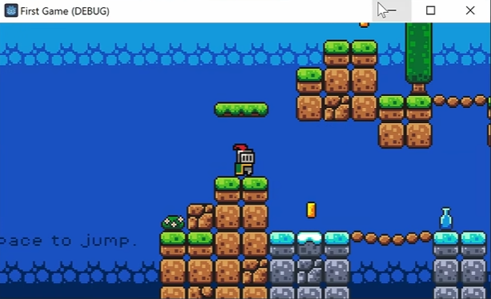
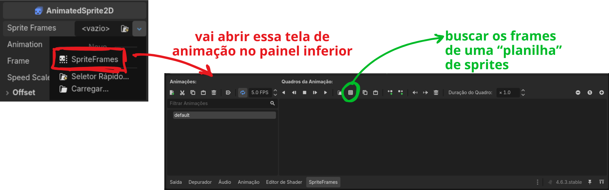
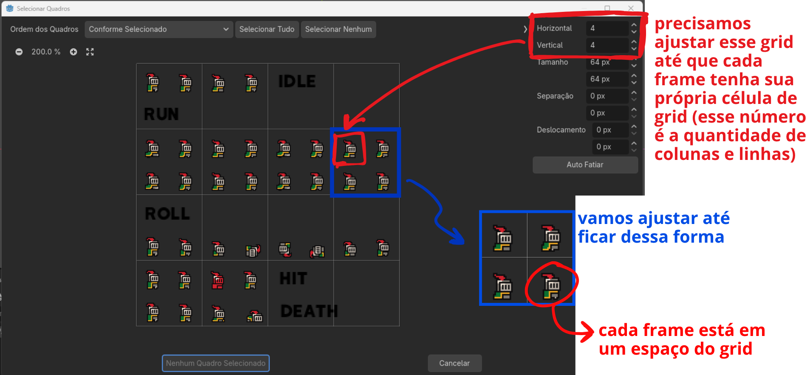
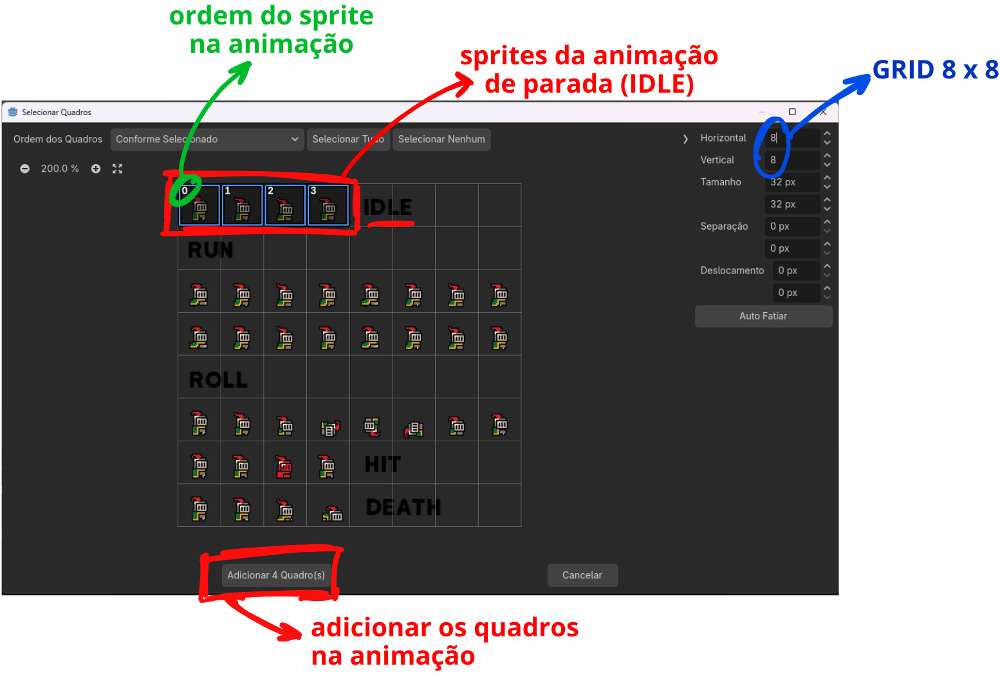

Link do vídeo: https://youtu.be/LOhfqjmasi0?si=JzgCt9r8iZ8poMSK
Obs: o vídeo foi feito na versão 4.1 da GODOT e hoje (out/26) estamos na versão 4.6 então algumas coisas vão ser diferentes (e vou citar aqui)
Os capítulos abaixo estão separados de acordo com a divisão do vídeo
# GODOT
- GODOT é muito amigável pra quem tá começando, open source e grátis
- dá pra fazer desde jogos 2D até um FPS 3D
## Começando
Para instalar: [[Primeiros Passos#Instalação]]
- é muito fácil de instalar e roda até no browser

Criando um novo projeto: [[Primeiros Passos#Criando um novo projeto]]

Assim que fizermos isso já vai abrir um canvas em branco, que basicamente vai ter os seguintes componentes: [[Primeiros Passos#O editor da GODOT]]

Aqui, nosso objetivo é criar um jogo simples 2D:

Temos:
- Jogadores
- Inimigos
- Plataformas móveis
- Moedas coletáveis

Para **programação**, GODOT usa sua própria linguagem de programação chamada **GDScript**
- Não precisa se preocupar em entender totalmente os códigos (no próximo vídeo ele fala sobre GDScript)

Para fazer um jogo vamos precisar dos **"ingredientes"** (os assets), como:
- Sprites
- Models
- Textures
- Sounds
Os assets desse jogo estão disponíveis em:
https://brackeysgames.itch.io/brackeys-platformer-bundle
Podemos encontrar assets em vários outros lugares como:
- itch.io
- opengameart.org
- kenney.nl
Se ele for CC0 significa que ele é livre para uso sem precisar dar créditos

Voltando pro canvas, no lado inferior esquerdo temos o **PAINEL DE ARQUIVOS (lista os arquivos do projeto)**
- Por padrão ele começa apenas com o icon.svg (que é o ícone da GODOT)
- Vamos criar 3 novas pastas: assets, scenes e scripts
- Vamos baixar os assets, extrair o zip e arrastar todas as pastas pra essa pasta de assets

## Como a GODOT funciona
Leia mais em: [[Primeiros Passos#Principais conceitos]]
Pra fazer qualquer coisa na GODOT nós vamos usar **nodes**
Então qualquer elemento na GODOT vai ser **um conjunto de nós**, sendo assim o nó vai ser o bloco fundamental do nosso jogo!
Tem vários tipos e cada um tem sua função:
- Sprite: mostrar uma imagem
- Audio: tocar um som
- RigidBody: adicionar física

Em GODOT a gente **não precisa criar tudo do zero**, o nosso trabalho é basicamente **colocar tudo isso junto e organizá-los**

Podemos estender nodes para criar outros nós mais poderosos
Criar um jogo na GODOT é combinar e estender nós!

Para evitar criar um nó dentro de outro dentro de outro até ficar uma coisa super complexa, vamos criar as **cenas** para organizar nosso trabalho
- As cenas vão permitir que a gente agrupe nós em **pacotes reutilizáveis**

Todas as cenas vão ser organizadas de forma a termos uma **árvore de nós**, onde o primeiro nó é chamado de nó raiz

## Player 1.0
A base do nosso jogo será feita através da criação de nós, se você não sabe fazer ainda leia: [[Primeiros Passos#Nós]]
Sempre que quisermos **testar como tá ficando**, seguir os passos em [[Primeiros Passos#Botão de teste de execução]]

- Vamos clicar em "**+**" e procurar por "**CharacterBody2D**"
	- Ao criar não vamos ver nada pq precisamos adicionar as partes gráficas

O próximo passo é adicionar a animação e pra isso vamos precisar ajustar as propriedades no Inspetor, leia: [[Primeiros Passos#Inspetor]]
### AnimatedSprite2D
Vai ser o nó usado para criar uma animação 2D na GODOT
- Primeiramente vamos criar um nó de "**AnimatedSprite2D**"
- Vamos clicar nesse nó e ir no inspetor
- Depois em "**Sprite Frames**", vamos em "Novo" e selecionar "**SpriteFrames**"
- Vai abrir a janela de animação e nela vamos selecionar o ícone em verde de "**Add frames from sprite sheet (Ctrl+Shift+O)**"

- Na tela que abrir vamos buscar em **assets > sprites** e selecionar o arquivo "**knight.png**".
- Vai abrir essa tela abaixo
	- A gente tem **todos os frames da animação do ator em uma única imagem**: é o que chamamos de **sprite sheet** (é bem eficiente ao invés de precisar criar uma imagem pra cada frame)

- Nessa tela vamos precisar ajustar as informações de "**Horizontal**" e "**Vertical**"
	- Essa informação é **quantas colunas e linhas** temos na sprite sheet
		- Quando ajustamos esses valores o `Tamanho` já vai sendo ajustado automaticamente
	- Vamos **ajustar até cada frame ficar em uma célula separada** dessa sheet (nesse caso seria 8 x 8)
- Temos ainda mais 3 propriedades
	- `Separação`: define quanto de **espaço** existe **entre os frames**
	- `Deslocamento`: ajusta a imagem quando existe **margem na borda**
	- `Auto Fatiar`: tenta detectar o grid sozinho
- Para **adicionar uma animação** vamos apenas **clicar nos frames na ordem que queremos que eles apareçam nessa animação**
	- Ao clicar no primeiro ele já vai aparecer 0, no seguinte aparece 1 e assim por diante
	- Se quisermos remover basta clicar novamente
	- Para criar a animação de parada (IDLE) podemos clicar nos 4 primeiros sprites e ir em "**Adicionar 4 Quadro(s)**"

- Nesse momento já vamos ver o nosso Character na tela e podemos usar o scroll do mouse para aproximar
