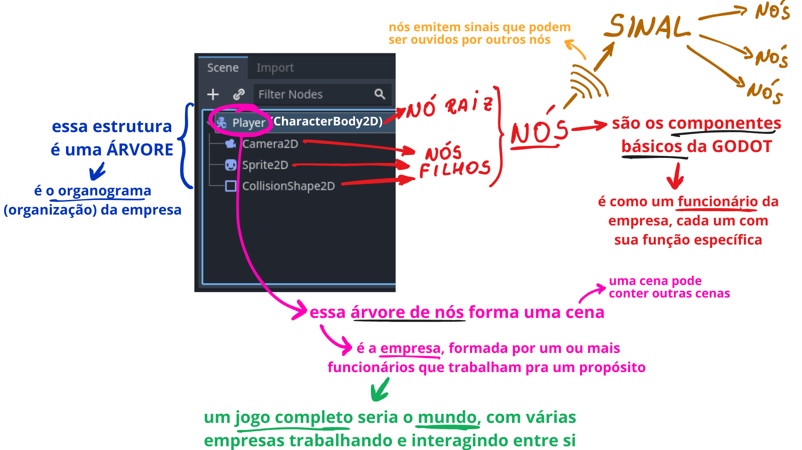
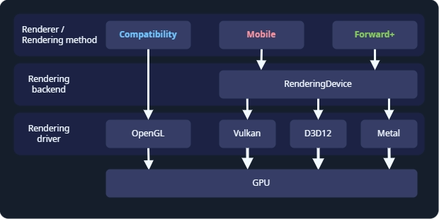
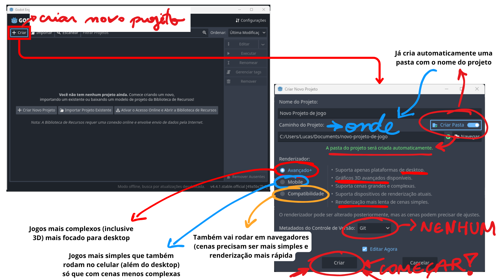
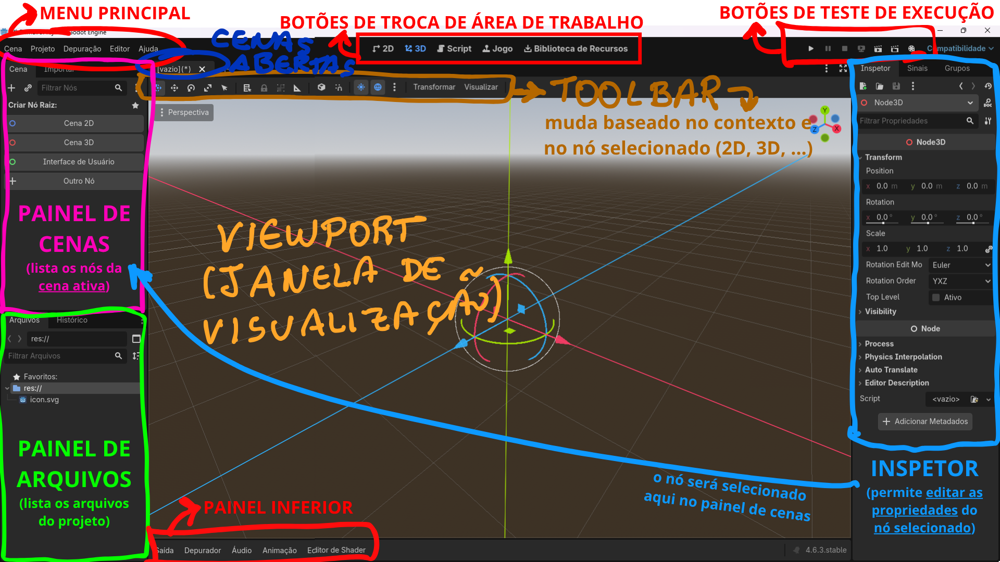

O que é GODOT?
> Godot é um motor (engine) de jogos 2D e 3D de uso geral projetado para dar suporte a qualquer tipo de projeto. Você pode usá-lo para criar jogos ou aplicativos que podem ser lançados em computadores, celulares e também na internet. - [O que é o Godot? - Documentação Oficial](https://docs.godotengine.org/pt-br/4.x/getting_started/introduction/introduction_to_godot.html#:~:text=Godot%20%C3%A9%20um%20motor%20(engine)%20de%20jogos%202D%20e%203D%20de%20uso%20geral%20projetado%20para%20dar%20suporte%20a%20qualquer%20tipo%20de%20projeto.%20Voc%C3%AA%20pode%20us%C3%A1%2Dlo%20para%20criar%20jogos%20ou%20aplicativos%20que%20podem%20ser%20lan%C3%A7ados%20em%20computadores%2C%20celulares%20e%20tamb%C3%A9m%20na%20internet.)
# Instalação
- Acessar: **[godotengine.org](https://godotengine.org/download/)**
- Tem 2 versões: 
	- **Padrão**: para **uso de GDScript** (linguagem própria)
	- **.NET**: para quem tem experiência com C#
- A GODOT não tem instalação, **é portátil** 
	- É só extrair o zip e executar o arquivo **`.exe`**
	- Tem 2 versões, a **normal (que geralmente usamos)** e a **`_console`** (abre um terminal junto) 
# Principais conceitos
> Em Godot, um jogo é uma **árvore** de **nós** que você agrupa em **cenas**. Você pode conectar esses nós para que eles possam se comunicar usando **sinais**. - [Visão geral dos principais conceitos do Godot - Documentação Oficial](https://docs.godotengine.org/pt-br/4.x/getting_started/introduction/key_concepts_overview.html#:~:text=Em%20Godot%2C%20um%20jogo%20%C3%A9%20uma%20%C3%A1rvore%20de%20n%C3%B3s%20que%20voc%C3%AA%20agrupa%20em%20cenas.%20Voc%C3%AA%20pode%20conectar%20esses%20n%C3%B3s%20para%20que%20eles%20possam%20se%20comunicar%20usando%20sinais.)

## Nós
São os menores blocos de construção do jogo, cada um com sua função específica
Ex: 
- `CharacterBody2D`: representa um personagem que pode se movimentar e colidir.
- `CollisionShape2D`: define a área de colisão, permitindo que colida com paredes e objetos
- `Sprite2D`: exibe uma imagem, podendo ser a aparência do personagem por exemplo
- `Camera2D`: funciona como a câmera do jogo (acompanha o personagem)
Os nós podem ser *organizados em estruturas de pai e filhos* chamados de **árvore**
Ao *salvar uma árvore de nós como uma **cena***, ela é exibida como **um único nó** com a estrutura interna oculta no editor
A maioria das coisas em GODOT será feita com os nós (já existem nós prontos para quase tudo que vamos precisar!)
## Cenas
Na GODOT você irá construir **cenas reutilizáveis**, que podem ser um personagem, uma arma, um menu de interface, uma casa ou até um nível inteiro
**A árvore de nós irá formar uma cena**, que ao ser salva ela será registrada como um **arquivo `.tscn`** e poderá ser reutilizada em qualquer parte do seu jogo
É comum termos **cenas dentro de outras cenas** (como um personagem dentro de um nível do jogo)
## Árvore da cena
Todas as cenas do jogo serão reunidas na árvore de cenas, onde cada ramo será uma cena diferente. **O seu jogo nada mais é que uma ligação entre várias cenas**
## Sinais
**Nós emitem sinais quando certos eventos ocorrem**, que podem ser usados para fazer com que **nós se comuniquem** de forma simples
Por exemplo, um botão emite um sinal ao ser pressionado. Você pode criar um código para ser executado ao receber esse evento de botão pressionado (como começar o jogo ou abrir um menu)
Sinais também podem indicar colisão de objetos, a entrada do objeto em uma área ou algo personalizado de acordo com a sua necessidade

Continuar: https://docs.godotengine.org/pt-br/4.x/getting_started/introduction/first_look_at_the_editor.html
# Primeiro projeto
- Clicar em **`+ Criar`**
- Colocar o **nome do projeto** (ele já atualiza o `Caminho do Projeto` automaticamente)
- Definir o **`Renderizador`**
	- **Avançado+**: permite muito **mais complexidade no desenvolvimento** (até 3D complexo) mas apenas para plataformas de **desktop**
	- **Mobile**: Desktop + **mobile** mas é **menos escalável para cenas complexas / 3D**
	- **Compatibilidade**: também roda **web** porém com menos recursos, tem renderização bem mais rápida de cenas simples. Usa renderizador **OpenGL 3**
	  
	 
		- A própria Godot faz todo o trabalho pra exportar pra qualquer plataforma que seja (Windows, Linux, Mac, iOS, etc)

- Clicar em **`Criar`**
  

- Ao criar, basicamente teremos algumas **áreas importantes** na GODOT:
	Ver também: https://docs.godotengine.org/pt-br/4.x/getting_started/introduction/first_look_at_the_editor.html#first-look-at-godot-s-editor
	
	